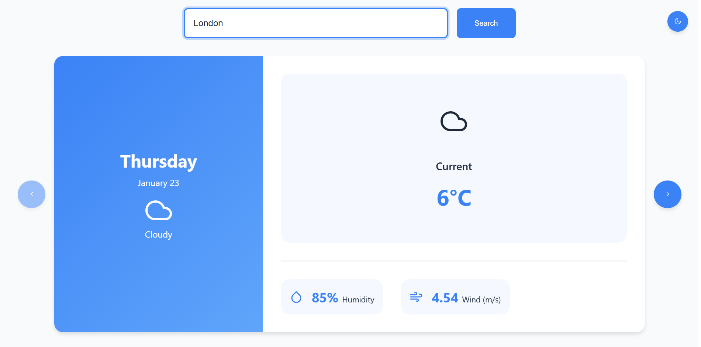
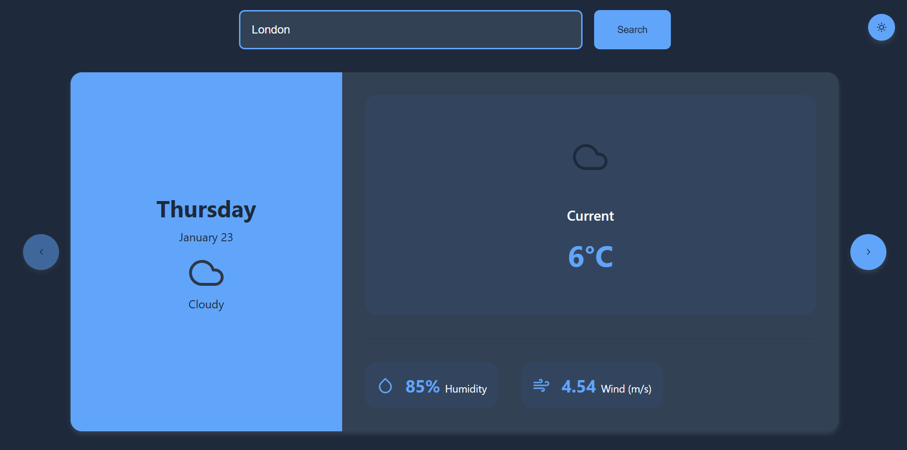

# Weather Forecast Application

This project is a weather forecast application built with **React**. It provides weather information for any city using the [OpenWeather API](https://openweathermap.org/api). The app supports light and dark themes and displays current weather along with daily forecasts.

---

## Features

1. **Search City**: Enter a city name to fetch weather data.
2. **Light/Dark Theme**: Toggle between light and dark themes.
3. **Daily Weather Details**:
   - Current temperature (for today).
   - Morning and evening temperatures (for future days).
   - Humidity and wind speed.
4. **Navigation**: Navigate between daily forecasts.

---

## Installation

Follow the steps below to set up and run the application:

### 1. Clone the Repository

```bash
git clone https://github.com/hakanberkiten/Weather-App
cd Weather-App
```

### 2. Install Dependencies

```bash
npm install
```

### 3. Setup the `.env` File

Create a `.env` file in the root directory to store your **API key** securely.

```env
REACT_APP_API_KEY=your_openweather_api_key
```

- Replace `your_openweather_api_key` with your OpenWeather API key.
- Never expose your `.env` file in version control to keep your API key secure.

### 4. Run the Application

```bash
npm start
```

The application will be available at `http://localhost:3000`.

---

## Usage

1. **Search for Weather**:
   - Type a city name in the search bar.
   - Press **Enter** or click the **Search** button.
2. **Switch Theme**:
   - Use the toggle button in the top-right corner to switch between light and dark themes.
3. **Navigate Forecasts**:
   - Use the left and right arrows to navigate through daily forecasts.

---

## API Integration

This application uses the **OpenWeather API** to fetch weather data. Below is the key endpoint used:

### Forecast Endpoint

```bash
https://api.openweathermap.org/data/2.5/forecast
```

#### Parameters:
- `q`: City name (e.g., `London`).
- `units`: Temperature unit (set to `metric` for Celsius).
- `appid`: Your OpenWeather API key.

**Example request**:

```bash
https://api.openweathermap.org/data/2.5/forecast?q=London&units=metric&appid=your_openweather_api_key
```

---

## Theme Configuration

- **Light Mode**: Default theme.
- **Dark Mode**: Automatically loaded if saved in `localStorage`.

---

## Dependencies

- **React**: Frontend framework.
- **axios**: HTTP client for API calls.
- **react-icons**: Icon library.

---

## Deployment

To build and deploy the application:

1. Build the project:

   ```bash
   npm run build
   ```

2. Deploy the `build` folder to your hosting platform.

---

## Screenshots

### Light Theme



### Dark Theme



---

## Notes

- Ensure you store sensitive keys like the API key in the `.env` file and **never expose it publicly**.
- For additional weather icons or data, refer to the [OpenWeather API documentation](https://openweathermap.org/api).

---
